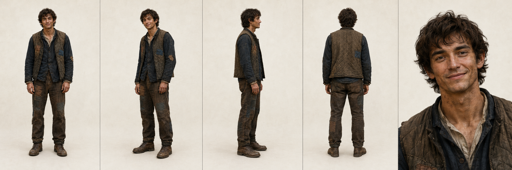

# Ash — Visual Character Sheet

Canonical visual reference for Ash. All future image generation of Ash should start from this sheet and the anchor image at `reference/visual/ash-reference.png`. When prompting an image model, paste the **Locked Anchors** verbatim and adjust only the **Per-Scene Variables**.

## Locked Anchors (do not vary)

These features define Ash across all images. Treat them as non-negotiable.

### Build and bearing
- Lean, wiry build. Not muscular, not gaunt. The frame of someone who works with his hands but doesn't eat quite enough.
- Average height for the setting, slightly tall but not imposing. Long limbs relative to torso.
- Posture is loose and slightly forward, weight evenly placed. Hands hang easy at his sides; he does not stand at attention.
- Late twenties. Read as a young man who has already done a lot of physical work, not a boy.

### Face
- Oval face, narrow at the jaw, with prominent cheekbones and a defined but not sharp jawline.
- Warm light-olive / tanned skin, weathered from outdoor work. Faint sun lines at the eyes.
- Dark brown eyes, set slightly deep. Warm rather than piercing.
- Straight nose, narrow bridge, unbroken.
- Wide mouth that defaults to a small, lopsided, closed-lip smile, the corners turning up unevenly. He looks like he is about to make a small joke even when he isn't.
- Light, uneven stubble across jaw and upper lip. Not a beard. Three or four days of growth at most. Never clean-shaven, never full bearded.

### Hair
- Dark brown, near-black in low light. Thick, wavy, slightly tousled.
- Worn medium-short: long enough to fall across the forehead in pieces, short enough that it does not reach the collar in back. Looks like he cuts it himself or lets someone do it quickly.
- No styling product. Always reads as wind-moved or work-moved.

### Hands and skin
- Working hands. Knuckles slightly enlarged, nails short and not entirely clean.
- A faint, persistent grime in the creases of the palms and the cuticles, even when the rest of him reads as cleaned-up.
- No visible tattoos. No jewelry.

### Expression baseline
- Default expression is the small lopsided smile described above, paired with eyes that do not fully commit to it. The mouth is warmer than the eyes.
- He looks at people directly when listening and slightly away when he is the one talking.

## Wardrobe (baseline kit)

Ash's working clothes in Solathis. This is what he wears in any scene where there is no specific reason to be dressed otherwise.

- **Shirt:** Collarless, button-placket work shirt in faded dark indigo / near-black washed linen-cotton. Sleeves long, cuffs unbuttoned and pushed up the forearms when working. Visibly worn at the elbows and cuffs.
- **Vest:** Quilted, sleeveless work vest in mixed brown and dark grey panels, patched in at least two places with visibly different cloth (one brown patch on the left front, one darker patch on the right). Diamond-pattern quilting. Open, never buttoned.
- **Trousers:** Heavy brown work trousers, originally one color, now visibly patched at both knees and along the thighs with squares of contrasting cloth (lighter brown, dark grey, faded indigo). The patching is utilitarian, not decorative. Hems are scuffed and stained darker from mud near the boots.
- **Boots:** Brown leather work boots, ankle-high, laced. Scuffed, mud-streaked, well-broken-in. Not new. Not falling apart.
- **Belt:** Plain leather, narrow, often hidden under the vest. No visible buckle ornamentation.
- **No hat by default.** No coat by default. No scarf, no gloves shown unless the scene calls for them.

The overall palette of the kit is brown, dark indigo, and faded near-black, with the patchwork providing the only variation. He should never read as colorful.

## Per-Scene Variables (adjust freely)

These can change scene to scene without breaking the character.

- Expression (the lopsided smile is the default but is not required; anxious, tired, focused, grieving, etc. all valid).
- Hair wetness, dirt, blood, sweat.
- Posture (working, kneeling at a bench, walking, slumped, etc.).
- Lighting and environment.
- Addition of a coat, hat, or tools when the scene requires it. The vest stays underneath unless the scene explicitly removes it.
- Age can flex slightly younger for flashbacks (late teens to early twenties), but face structure and hair should remain consistent.

## What to avoid

- Do not make him handsome in the conventional sense. He is appealing because of the smile and the warmth in the eyes, not because of bone structure. Avoid model-grade jawlines and avoid making him look chiseled.
- Do not clean him up. There should always be at least one visible mark of work: dirt in the cuticles, mud at the boots, a stain on the trousers, sweat at the hairline.
- Do not give him a uniform, livery, or any clothing that reads as belonging to a guild, military, or institutional order.
- Do not add tattoos, piercings, or jewelry.
- Do not give him a full beard or a clean-shaven face. Stubble only.
- Do not make the hair tidy or styled.
- Do not put him in bright colors. The palette stays brown / indigo / near-black.
- Do not pose him heroically. He stands easy, slightly forward, hands at his sides or busy with something.

## Prompt seed (for image models)

> Lean, wiry man in his late twenties, average-tall, warm light-olive skin weathered from outdoor work, dark brown wavy tousled medium-short hair falling across the forehead, dark brown eyes, prominent cheekbones, narrow jaw, straight nose, light uneven three-day stubble, small lopsided closed-lip smile. Wearing a faded dark-indigo collarless work shirt with sleeves pushed up, a sleeveless quilted brown-and-grey patched work vest open over it, heavy brown work trousers patched at both knees with contrasting cloth squares, scuffed brown ankle-high leather work boots, mud at the hems. Working hands, dirt in the cuticles. Loose, slightly forward posture, hands easy at his sides. Naturalistic painterly lighting, muted earth-tone palette of brown, dark indigo, and near-black. No tattoos, no jewelry, no hat, no styling.

Append per-scene variables (environment, action, expression, secondary characters) after the seed.
